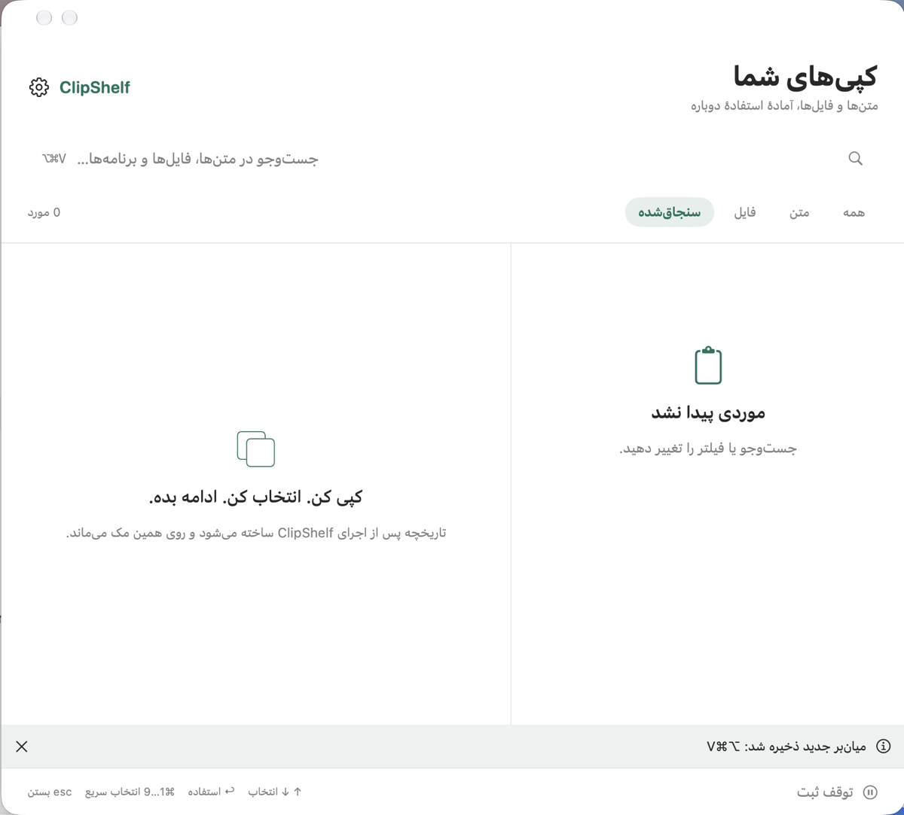

# ClipShelf

**[⬇ Download for macOS / دانلود نسخهٔ مک — Apple Silicon](Downloads/ClipShelf-1.2.0-macos-arm64.zip?raw=true)**

Version 1.2.0 · macOS 13 or later · M1/M2/M3/M4 and later Apple Silicon Macs. No Xcode is needed to use the downloaded app.

Quit any running copy of ClipShelf, unzip the download, move `ClipShelf-1.2.0.app` to Applications, and open it from there.

ClipShelf is a lightweight macOS clipboard history app for text, images, files, and reusable snippets. It lives in the menu bar, keeps history locally, and lets you bring back an earlier item with a configurable global shortcut.

[فارسی](README.fa.md) · English

## فارسی

برای نصب، ابتدا از ClipShelf قبلی خارج شوید، فایل دانلودشده را از حالت فشرده خارج کنید و `ClipShelf-1.2.0.app` را به پوشهٔ Applications ببرید و از همان‌جا باز کنید. برای استفاده از نسخهٔ آماده نیازی به Xcode نیست.

ClipShelf یک برنامهٔ سبک برای نگهداری و جست‌وجوی تاریخچهٔ کلیپ‌بورد در مک است. متن، فایل‌ها، تصویرها و اسنیپت‌های آماده را یک‌جا ببینید و با میان‌بر صفحه‌کلید دوباره استفاده کنید. اطلاعات روی همین مک می‌ماند.

راهنمای فارسی کامل در [README.fa.md](README.fa.md) است.



The interface is currently Persian (RTL). English localization is a welcome contribution.


## Features

- Captures plain text, RTF/HTML formatting, PNG/TIFF images, and one or more file URLs copied in Finder
- Adds new macOS screenshots saved as PNG, JPEG, or TIFF images in the configured screenshot folder to image history (optional)
- Search by text, file path, or source app
- Save reusable snippets, pin frequently used clips, and filter by item type
- Configurable global shortcut; default: `Control + Shift + V`
- Keyboard-first picker: arrow keys to navigate, Return to use, `⌘1`–`⌘9` for quick selection
- Optional automatic paste back into the previous app through macOS Accessibility permission
- Local JSON persistence, deduplication, adjustable history limit, and a pause switch
- Bounded image previews and storage to keep memory and disk use predictable
- Respects common concealed and transient pasteboard markers

## Requirements

- macOS 13 or later
- Xcode Command Line Tools or Xcode, with Swift 6 or later, to build from source

The code has no third-party dependencies.

## Install from source

```sh
git clone <your-repository-url> ClipShelf
cd ClipShelf
./build.sh
open .build-output/ClipShelf.app
```

The script builds a signed, ad-hoc `ClipShelf.app` at `.build-output/ClipShelf.app` inside the repository and runs the core checks first. Open it with `open .build-output/ClipShelf.app`, or move it to `/Applications`. Because the app is not notarized, macOS may ask you to confirm that you want to open a locally built copy.

The packaging script uses SwiftPM's native build system because it is the most reliable option for the Command Line Tools setup used to develop this project. SwiftPM currently prints a deprecation warning for that implementation; it does not affect the generated app. GitHub CI uses the normal SwiftPM build system.

## Use

1. Launch ClipShelf. It appears in the menu bar.
2. Copy text in any app, or copy one or more files in Finder with `⌘C`.
3. Press the global shortcut to open the picker.
4. Select a clip and press Return, double-click it, or use `⌘1`–`⌘9`.

Without Accessibility permission, ClipShelf restores the selected item to the clipboard and returns you to the previous app; press `⌘V` yourself. To enable automatic paste, open ClipShelf settings and use the Accessibility button. This permission is required because macOS protects synthesized keyboard input.

## Privacy and limits

ClipShelf never sends clipboard content over the network. History is stored at:

```text
~/Library/Application Support/ClipShelf/history.json
```

The history file has user-only permissions but is not separately encrypted. Pause recording before copying sensitive material. The app records only clips made while it is running; macOS does not expose clipboard history from before launch.

This version stores plain text, RTF/HTML representations when available, PNG/TIFF clipboard images, new PNG/JPEG/TIFF screenshots saved while ClipShelf is running, manually saved text snippets, and paths to files. Screenshot import can be disabled in settings. macOS may ask for Files & Folders access to the configured screenshot location. Other copied files are represented by paths only; if a remembered file has moved or been deleted, copy it again from Finder.

Default limits: 200 history clips, 8 MB per clip, 20 MB total archive, 20 pinned items, and 100 reusable snippets. Oversized and unusually high-resolution images are skipped to keep resource use bounded.

## Development

```sh
swift build
swift run ClipShelfChecks
swift run ClipShelf --demo
```

`ClipShelfChecks` runs seven deterministic core checks: deduplication, pin preservation, persistence, Unicode search, size limits, corrupt-history reporting, and distinct file-path identity.

For an additional pasteboard integration check in a normal graphical macOS session:

```sh
CLIPSHELF_GUI_CHECKS=1 ./build.sh
```

It uses an isolated named pasteboard and a temporary directory, not your personal clipboard or history.

## Current status

ClipShelf was manually tested for text capture, search, restoring a previous text clip, manual paste, shortcut configuration, and its macOS interface. Rich-text, image, snippet, and saved-screenshot import are new; these flows, automatic paste into another app, and Finder file/image round trips still need full end-to-end desktop testing. Please report results in an issue if you test these flows.

## Scope

ClipShelf follows the fast keyboard picker and pasteboard privacy markers found in [Maccy](https://github.com/p0deje/Maccy), with image history and reusable-item workflows found in broader tools like [CopyQ](https://github.com/hluk/CopyQ) and [Clippy](https://github.com/yarasaa/Clippy). Snippets are deliberately manual. OCR, AI transforms, screenshot editing, scripting, and cloud sync are outside the app's lightweight local-first scope.

## Contributing

Issues and pull requests are welcome. See [CONTRIBUTING.md](CONTRIBUTING.md), [SECURITY.md](SECURITY.md), and [CHANGELOG.md](CHANGELOG.md). This project is released under the [MIT License](LICENSE).
